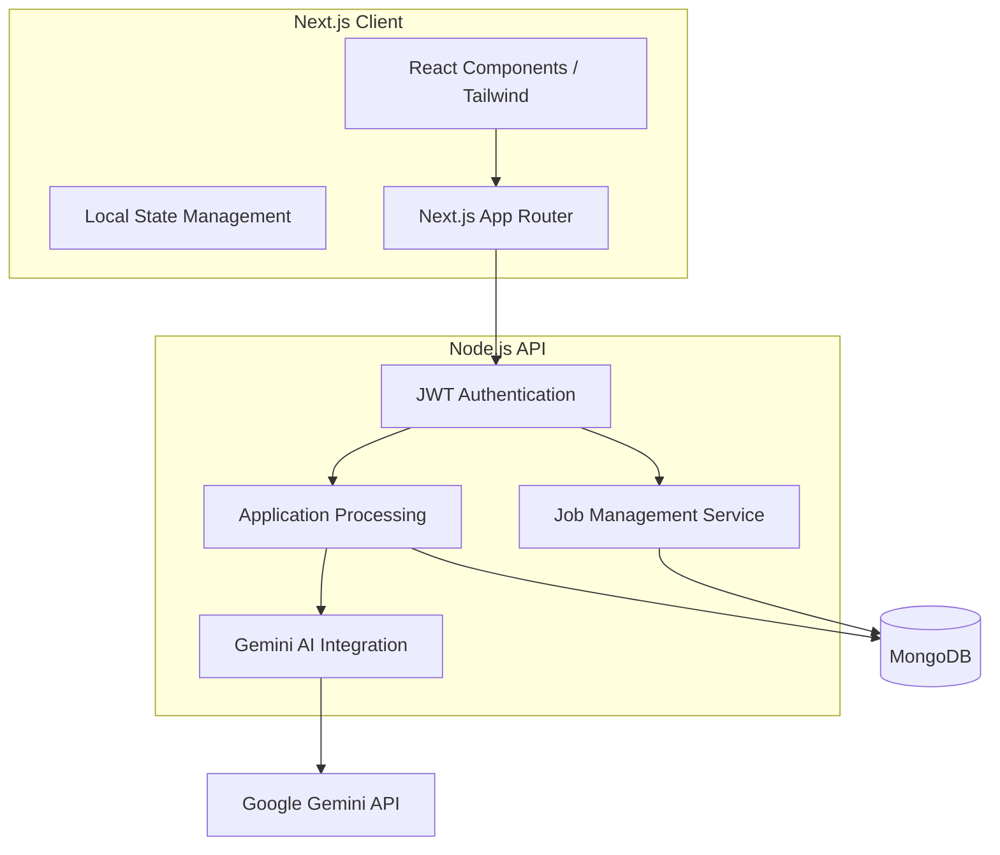

# Umurava AI - Talent Profile Screening Tool


## Table of Contents
- [Overview](#overview)
- [Architecture](#architecture)
- [Key Technical Features](#key-technical-features)
- [Setup Instructions](#setup-instructions)
- [AI Decision Flow](#ai-decision-flow)
- [Assumptions and Limitations](#assumptions-and-limitations)
- [Deployment](#deployment)

## Overview
**Umurava AI** is a production-ready AI-powered talent screening platform built for the **Umurava AI Hackathon**. The platform addresses the critical challenges recruiters face today: high application volumes and the difficulty of objectively comparing diverse candidate profiles.

Our solution leverages the **Gemini AI API** to accurately, transparently, and efficiently screen and shortlist job applicants, providing recruiters with ranked shortlists and deep qualitative insights while keeping humans in control of final hiring decisions.

## Architecture
The application follows a modern decoupled architecture, ensuring scalability and performance.



### Key Technical Features:
- **Next.js 15 (App Router)**: Utilizing the latest Next.js features for optimal performance and SEO.
- **Tailwind CSS 4**: A modern, utility-first styling approach for a premium, responsive UI.
- **Phosphor Icons**: A cohesive and high-quality icon system for enhanced UX.
- **Centralized API Management**: Robust error handling and configuration for backend communication.
- **Responsive Dashboard**: Tailored experiences for both Recruiters and Applicants.

## Setup Instructions

### Prerequisites
- Node.js 18.x or later
- NPM or Yarn

### Local Development
1. **Clone the repository:**
   ```bash
   git clone <repository-url>
   cd umurava-frontend
   ```

2. **Install dependencies:**
   ```bash
   npm install
   ```

3. **Configure Environment Variables:**
   Create a `.env.local` file in the root directory (refer to `.env.example`):
   ```bash
   NEXT_PUBLIC_API_BASE_URL=https://your-backend-api.com
   ```

4. **Run the development server:**
   ```bash
   npm run dev
   ```
   Open [http://localhost:3000](http://localhost:3000) to view the application.

## AI Decision Flow
The screening process is powered by a sophisticated prompt engineering strategy using the Gemini API:

1. **Context Ingestion**: The system analyzes the specific job requirements (skills, experience, education, and cultural fit).
2. **Profile Analysis**: Applicant profiles (structured data and unstructured resumes) are parsed and compared against the job DNA.
3. **Multi-Dimensional Scoring**: Candidates are scored across several dimensions (Technical Skills, Experience, Education, Relevance, and Soft Skills).
4. **Ranked Shortlisting**: AI generates a ranked list of the Top 10/20 candidates based on their weighted final scores.
5. **Reasoning Generation**: For every shortlisted candidate, the AI provides:
   - **Match Score**: A percentage indicating alignment.
   - **Strengths**: Key areas where the candidate excels.
   - **Gaps**: Potential risks or missing qualifications.
   - **Recommendation**: A natural-language explanation for the shortlist placement.

## Assumptions and Limitations
- **Data Schema**: The screening logic assumes that applicant data follows the Umurava Talent Profile Schema for structured ingestion.
- **Human-in-the-loop**: The AI provides recommendations and rankings, but final status updates (Shortlist, Hire, Reject) are triggered manually by recruiters.
- **LLM Context**: Scores are generated based on the information provided in the profile; missing data in a profile may result in a lower match score.

## Deployment
The frontend is optimized for deployment on **Vercel**. 

- **Live URL**: [https://umurava-fe.vercel.app/](https://umurava-fe.vercel.app/)
- **Production Build**: `npm run build`

---

Built for the Umurava AI Hackathon.
